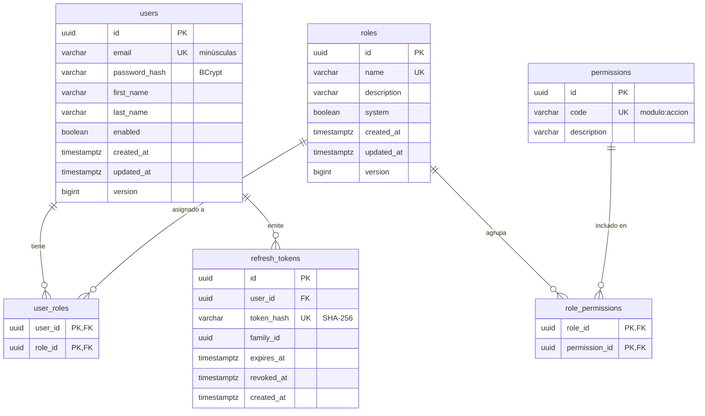

# Diagrama entidad-relación

```mermaid
erDiagram
    users ||--o{ user_roles : tiene
    roles ||--o{ user_roles : "asignado a"
    roles ||--o{ role_permissions : agrupa
    permissions ||--o{ role_permissions : "incluido en"
    users ||--o{ refresh_tokens : emite

    users {
        uuid id PK
        varchar email UK "minúsculas"
        varchar password_hash "BCrypt"
        varchar first_name
        varchar last_name
        boolean enabled
        timestamptz created_at
        timestamptz updated_at
        bigint version
    }
    roles {
        uuid id PK
        varchar name UK
        varchar description
        boolean system
        timestamptz created_at
        timestamptz updated_at
        bigint version
    }
    permissions {
        uuid id PK
        varchar code UK "modulo:accion"
        varchar description
    }
    user_roles {
        uuid user_id PK, FK
        uuid role_id PK, FK
    }
    role_permissions {
        uuid role_id PK, FK
        uuid permission_id PK, FK
    }
    refresh_tokens {
        uuid id PK
        uuid user_id FK
        varchar token_hash UK "SHA-256"
        uuid family_id
        timestamptz expires_at
        timestamptz revoked_at
        timestamptz created_at
    }
```
